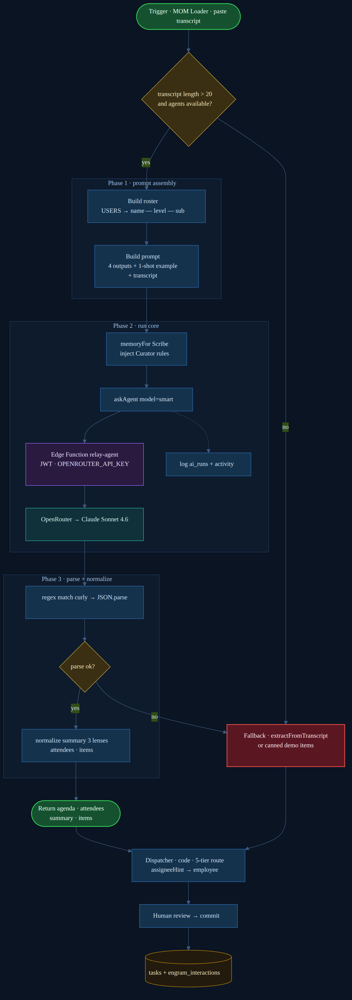
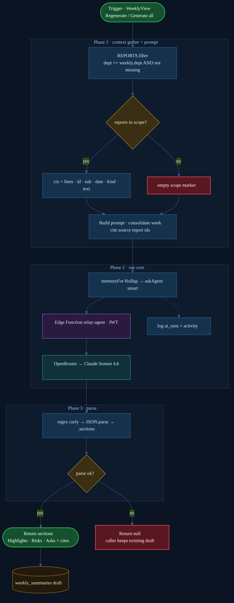
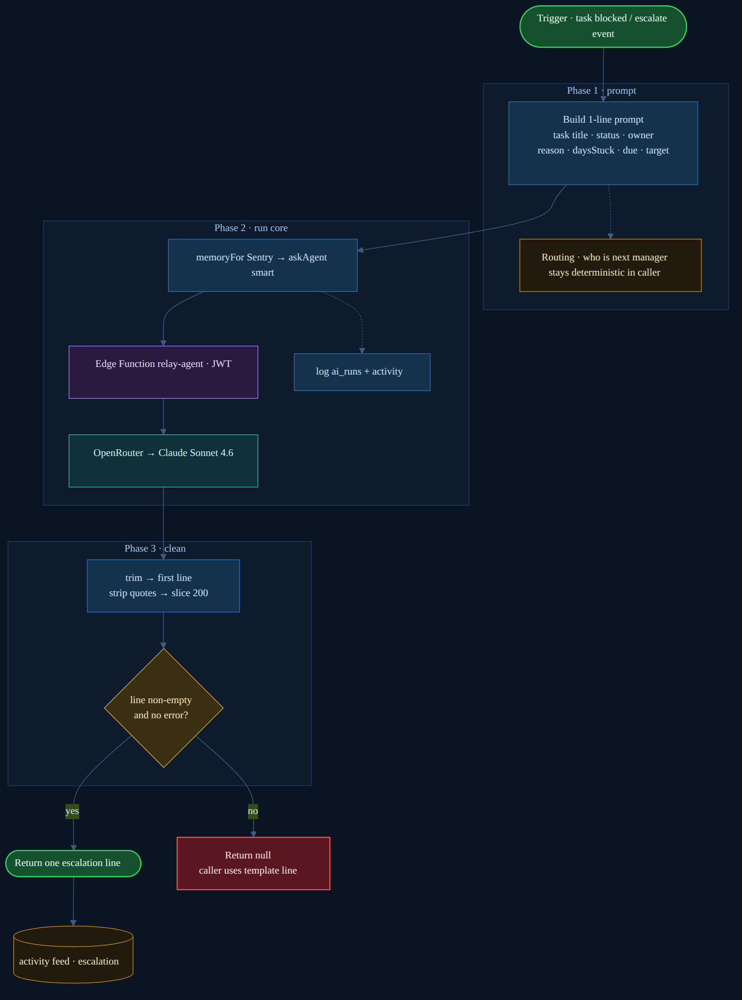
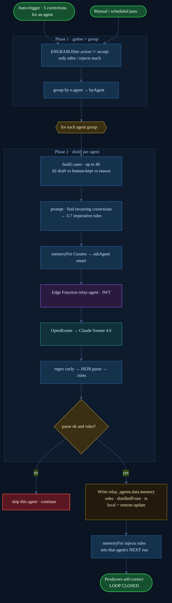
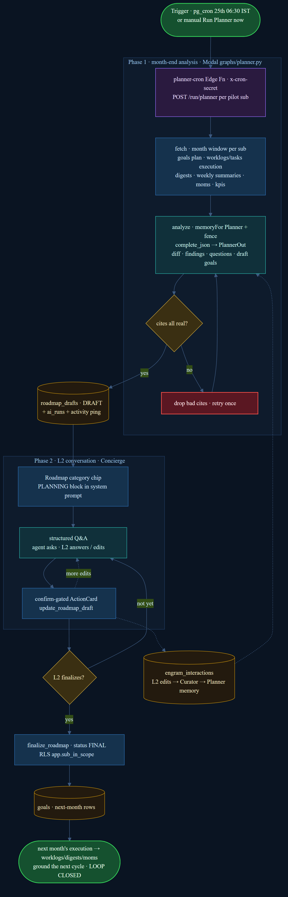

# Relay Agent Flow Diagrams

Per-agent control-flow diagrams for the four Relay agents, rendered from the
`.mmd` Mermaid sources in this folder. Each maps the real code path:
trigger → prompt → `run()` core → Edge Function → Claude Sonnet 4.6 → parse →
output (with fail-soft fallback).

> Regenerate after editing a source:
> ```bash
> npx -y @mermaid-js/mermaid-cli -i scribe.mmd -o scribe.png -b "#0a1422" -s 2
> ```

## Scribe — meeting transcript → action items


## Rollup — daily reports → weekly summary


## Sentry — stuck task → escalation line


## Curator — corrections → learned rules (self-evolving loop)


## Planner — month-end execution diff → L2 conversation → next-month roadmap


---

### Legend

| Color | Meaning |
|-------|---------|
| 🟢 green | start / end (trigger, return value, loop closed) |
| 🟦 blue | process step (code) |
| 🟨 gold diamond | decision / loop |
| 🟪 purple | Edge Function (`relay-agent`, JWT-gated) |
| 🟩 teal | LLM model (OpenRouter → Claude Sonnet 4.6) |
| 🟥 red | stop / fallback / skip |
| 🟫 store | persisted table or deterministic side-note |

Source code: `supabase-client.js:311-503`, `views-relay.jsx:306-491`,
`supabase/functions/relay-agent/index.ts`.
