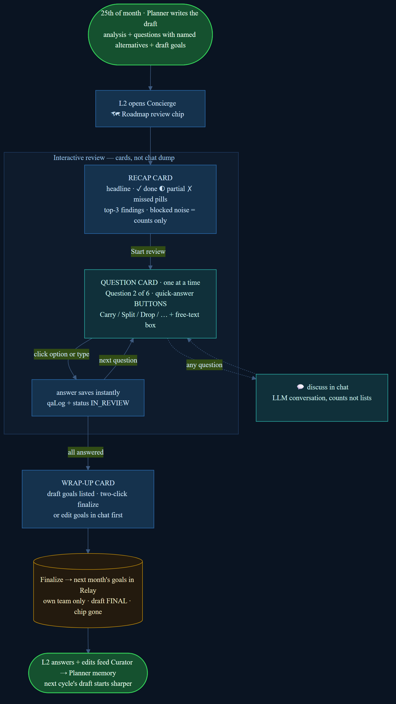

# The Monthly Roadmap Review — how it works

*Plain-language walkthrough of the review experience in Relay's Concierge chat. Share freely.*

.png)

## What it is

Every month, an AI planner reads your team's real execution data out of Relay —
tasks, worklogs, weekly digests, meeting notes, KPIs — and prepares next
month's roadmap draft **before the planning meeting**: what was planned vs.
what was delivered, the gaps and risks that matter, pointed questions for the
team lead, and draft goals with the reasoning attached. The lead then reviews
it in a guided, click-through conversation — not a document, not a wall of text.

## The flow, step by step

**1. The 25th of the month — the draft writes itself.**
The Planner runs automatically, analyzes the month, and prepares the review.
Every claim it makes is backed by a real record — it cannot invent facts.

**2. The lead opens Concierge → the 🗺 Roadmap review chip is waiting.**
Only the lead of that team sees their team's review (enforced by the database,
not by convention).

**3. Recap card — the month at a glance.**
A short headline, three counters (✓ delivered · ◐ partial · ✗ missed), and the
top-3 findings. Blocked and escalated items appear as counts, not lists — the
detail is one question away in chat if wanted.

**4. One question at a time — click to answer.**
Each question comes with 2–4 concrete alternatives as buttons
(e.g. *Carry to next month · Split into smaller deliverables · Drop it ·
Escalate as a structural dependency*), plus a free-text box for nuance.
Progress shows as "Question 2 of 6." Every answer saves instantly.
Any question can be bounced into a normal chat discussion and back.

**5. Wrap-up — the draft goals, then two clicks to finalize.**
The proposed goals for next month are listed; the lead can finalize
(deliberately two clicks, so nothing ships by accident) or refine goals in
chat first.

**6. Goals go live in Relay.** For that team only. The draft locks, the chip
disappears, done — typically minutes, not the usual 2–3 meeting iterations.

**7. The loop closes.** Every answer and edit the lead makes becomes training
signal: the next month's draft starts from what the lead actually decided,
so the reviews get sharper every cycle.

## The guarantees

- **Human decides, always** — the AI drafts and asks; only the lead's explicit
  clicks change anything, and finalizing is double-confirmed.
- **Own team only** — a lead can see and finalize only their team's roadmap;
  leadership sees all. Database-enforced.
- **Evidence or silence** — every finding cites the underlying records; if a
  month's data is thin, the draft says so instead of guessing.
- **It runs itself** — the 25th of every month, no one has to remember.
